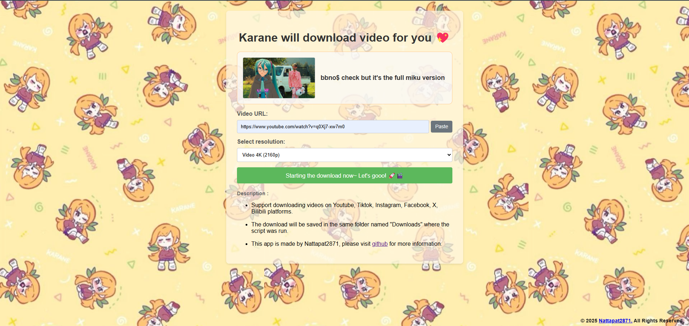

<h1 align="center">
     
    Karane-will-download-video-for-you
</h1>

        <a href="/README.md">English</a>   <b>ภาษาไทย</b>　

### หรือ ***Video Downloader***
`Python Script` นี้เป็น web app ที่พัฒนาด้วย `yt-dlp` ให้สามารถดาวโหลดวิดีโอได้ผ่านเบราว์เซอร์ แต่ต้องรัน `app.py` ก่อนถึงจะใช้ได้

> **เหตุผลที่ทำเว็บแอปนี้น่ะหรอ :** เว็บในเน็ตที่ให้โหลดวิดีโอส่วนใหญ่จะจำกัดความละเอียดของวิดีโอ แบบ อยากได้ 4k แต่มันต้องซื้อ premium ไรงี้ และก็บางเว็บถ้าความละเอียดสูงก็จะไม่มีเสียง และมันโหลดได้แค่แพลตฟอร์มเดียว ผมเลยอยากสร้างขี้นมาเอง ใช้เอง จะได้ไม่ต้องหงุดหงิด 555

## รองรับวิดีโอจากแพลตฟอร์ม :
*  **Youtube**
*  **Youtube Music**
*  **Tiktok**
*  **Facebook**
*  **Instagram** ( จะบัคการแสดงตัวอย่างรูปภาพ แต่ไม่มีผลกับการดาวโหลด )
*  **X**
* **Bilibili**

## สามารถดาวโหลดความละเอียดได้สูงสุด ถึง :
* **Overall the best** ( โดยรวมคือดีที่สุด คือถ้าวิดีโอเป็น FullHD ก็จะโหลด FullHD )
* **4K (2160p)**
* **2K (1440p)**
* **FullHD (1080p)**
* **HD (720p)**
* **SD (480p)**
* **Best Audio only (.mp3)**
